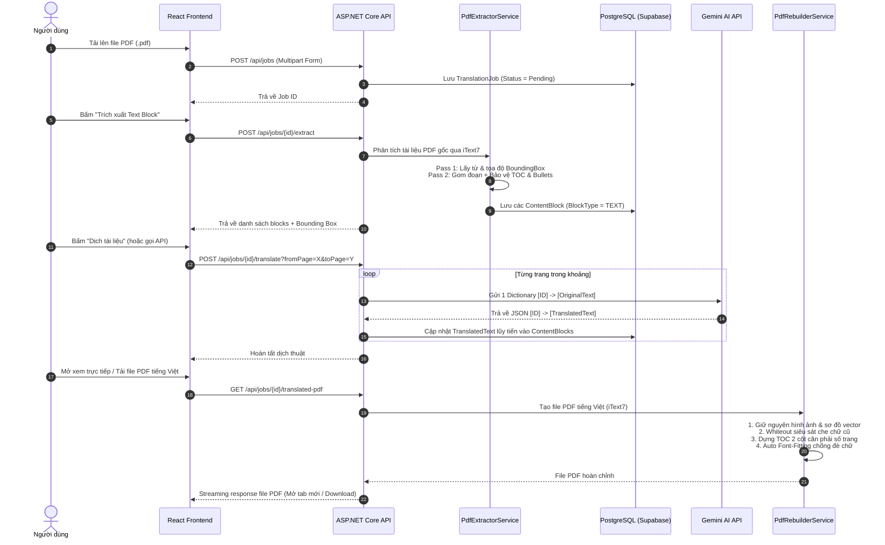

# 📄 PDF Translator Tools (`pdf-tools`)

> **Nền tảng dịch và xử lý tài liệu PDF chuyên ngành thông minh**, sử dụng AI (Google Gemini & OpenAI) để chuyển ngữ sang Tiếng Việt, đồng thời **bảo toàn 100% bố cục thị giác (Layout Preservation)**, sơ đồ vector, hình ảnh minh họa, bảng mục lục và khối mã nguồn gốc.

---

## 📑 Mục lục
1. [Giới thiệu tổng quan](#-giới-thiệu-tổng-quan)
2. [Các tính năng nổi bật](#-các-tính-năng-nổi-bật)
3. [Kiến trúc hệ thống & Công nghệ sử dụng](#-kiến-trúc-hệ-thống--công-nghệ-sử-dụng)
4. [Sơ đồ quy trình xử lý (Pipeline Workflow)](#-sơ-đồ-quy-trình-xử-lý-pipeline-workflow)
5. [Cấu trúc thư mục dự án](#-cấu-trúc-thư-mục-dự-án)
6. [Hướng dẫn cài đặt & Khởi chạy](#-hướng-dẫn-cài-đặt--khởi-chạy)
7. [Danh mục API chi tiết (API Reference)](#-danh-mục-api-chi-tiết-api-reference)
8. [Các bài toán bố cục PDF phức tạp đã giải quyết](#-các-bài-toán-bố-cục-pdf-phức-tạp-đã-giải-quyết)
9. [Giấy phép & Đóng góp](#-giấy-phép--đóng-góp)

---

## 🌟 Giới thiệu tổng quan

Dịch các tài liệu PDF kỹ thuật, sách giáo trình chuyên ngành (như *Object-Oriented Analysis and Design with UML*, tài liệu kiến trúc *Microservices*, *Design Patterns*...) thường gặp phải vấn đề nghiêm trọng:
- **Vỡ nát bố cục**: Các công cụ dịch thông thường chuyển đổi PDF thành văn bản thuần (plain text) hoặc Word làm mất hoàn toàn căn lề, cột và vị trí hình ảnh.
- **Xóa nhầm sơ đồ & hình vẽ**: Các đường kẻ ngang trang trí, sơ đồ khối, lưu đồ thuật toán bị che mất hoặc biến dạng.
- **Mục lục dồn dòng**: Tên đề mục và số trang bị gộp thành một đoạn văn xuôi, mất khả năng đối chiếu.
- **Đè chữ / Tràn dòng**: Câu tiếng Việt thường dài hơn tiếng Anh khoảng 15-30%, dẫn đến hiện tượng chữ của đoạn trên đè lên đoạn dưới hoặc tràn ra ngoài mép giấy.

**PDF Translator Tools** ra đời nhằm giải quyết triệt để những thách thức trên bằng phương pháp **Vector-Overlay & In-Box Fitting**: giữ nguyên toàn bộ các phần tử đồ họa của file PDF gốc, che sạch câu chữ cũ bằng khung whiteout siêu sát, và vẽ đè nội dung dịch chuẩn xác theo từng bounding box ban đầu.

---

## 🚀 Các tính năng nổi bật

- **🔍 Bóc tách cấu trúc theo không gian (Spatial Layout Extraction)**:
  - Sử dụng thư viện **iText7** để xác định tọa độ chính xác ($X, Y, Width, Height$), cỡ font và họ font của từng khối văn bản.
  - Thuật toán gom dòng thông minh (Pass 2) tự động bảo vệ tiêu đề mục lục (TOC), tiêu đề in hoa (ALL-CAPS), running headers/footers và danh sách gạch đầu dòng (`•`, `-`, `*`).
- **⚡ Dịch Batch theo từng trang bằng AI (Batch Page Translation)**:
  - Gom toàn bộ các khối văn bản của một trang thành một đối tượng từ điển `[ID] -> [OriginalText]`, dịch qua một request duy nhất tới **Google Gemini API** (`gemini-3.5-flash`).
  - Giảm đến **90% số lượng request HTTP**, tiết kiệm chi phí và thời gian xử lý, đồng thời cung cấp ngữ cảnh toàn trang giúp AI dịch tự nhiên và mạch lạc hơn.
- **🛡️ Bộ phân tích cú pháp dự phòng 3 lớp (Multi-Tier Resilient Parser)**:
  - Tự động xử lý khi LLM trả về định dạng JSON có kèm ký tự thừa: `JsonDocument.Parse` $\to$ `Utf8JsonReader.ParseValue` $\to$ Regex GUID matcher. Đảm bảo quy trình dịch liên tục, không bị ngắt quãng vì lỗi ngoại lệ cú pháp.
- **🎯 Tái tạo PDF chuẩn xác từng pixel (High-Fidelity PDF Rebuilding)**:
  - **Khung che Whiteout siêu sát**: Không làm đứt đoạn hay xóa mất các đường kẻ ngang vector trang trí liền kề.
  - **Thuật toán Auto Font-Fitting**: Tự động co nhẹ cỡ font theo từng nấc $0.5pt$ và điều chỉnh line leading ($1.15 \to 1.0$) để câu dịch tiếng Việt vừa khít bên trong bounding box gốc, **chống đè chữ $100\%$**.
  - **TOC 2-Column Engine**: Tự động dựng bảng 2 cột cho các dòng mục lục (Tên mục căn trái, Số trang căn thẳng hàng sát mép phải).
  - Hỗ trợ đầy đủ bộ font Unicode tiếng Việt (Arial TrueType).
- **🖥️ Giao diện người dùng hiện đại (React Dark Theme)**:
  - Kéo thả / Chọn file PDF nhanh chóng.
  - Hiển thị danh sách khối văn bản kèm tọa độ, cỡ font.
  - Xem PDF Debug có viền đỏ bao quanh từng khối text để kiểm tra độ bao phủ.
  - Mở xem trực tiếp file PDF tiếng Việt trên tab mới hoặc tải file về máy.

---

## 🛠 Kiến trúc hệ thống & Công nghệ sử dụng

```
┌─────────────────────────────────────────────────────────────────┐
│                       React + Vite Frontend                     │
│               (Upload, Status, Block List, PDF Viewer)           │
└────────────────────────────────┬────────────────────────────────┘
                                 │ HTTP / REST API (CORS)
                                 ▼
┌─────────────────────────────────────────────────────────────────┐
│                   ASP.NET Core Web API (.NET 10)                │
│ ┌─────────────────────────────────────────────────────────────┐ │
│ │ Controllers: JobsController (Upload, Extract, Translate...) │ │
│ └──────────────────────────────┬──────────────────────────────┘ │
│                                │                                │
│         ┌──────────────────────┼──────────────────────┐         │
│         ▼                      ▼                      ▼         │
│ ┌───────────────┐    ┌──────────────────┐    ┌────────────────┐ │
│ │ PdfExtractor  │    │ Gemini/OpenAI    │    │ PdfRebuilder   │ │
│ │ (iText7 Core) │    │ Translation Svc  │    │ (iText7 Layout)│ │
│ └───────┬───────┘    └─────────┬────────┘    └────────┬───────┘ │
└─────────┼──────────────────────┼──────────────────────┼─────────┘
          │                      │                      │
          ▼                      ▼                      ▼
┌──────────────────┐   ┌──────────────────┐   ┌───────────────────┐
│ PostgreSQL /     │   │ Google Gemini    │   │ Local Storage     │
│ Supabase (EF)    │   │ 3.5 Flash API    │   │ (storage/uploads) │
└──────────────────┘   └──────────────────┘   └───────────────────┘
```

### Công nghệ chính:
- **Backend**:
  - **C# / .NET 10** (ASP.NET Core Web API)
  - **iText7 9.7.0** (Xử lý PDF kernel & layout)
  - **Entity Framework Core 10.0** & **Npgsql** (Tương tác PostgreSQL / Supabase)
  - **DotNetEnv** (Quản lý biến môi trường)
  - **Swashbuckle / Swagger UI** (Tài liệu hóa API trực quan)
- **AI Engine**:
  - **Google Gemini API** (`gemini-3.5-flash` - mặc định, tốc độ phản hồi cao)
  - **OpenAI API** (`gpt-4o-mini` - tùy chọn dự phòng)
- **Frontend**:
  - **React 18** + **TypeScript**
  - **Vite 6** (Build tool siêu tốc)
  - **Axios** (HTTP client kết nối backend)
  - **Lucide React** (Bộ biểu tượng hiện đại)

---

## 🔄 Sơ đồ quy trình xử lý (Pipeline Workflow)



---

## 📁 Cấu trúc thư mục dự án

```
pdf-tools/
│
├── backend/                               # Mã nguồn Backend ASP.NET Core
│   ├── PdfTranslator.slnx                 # Solution file
│   ├── .env.example                       # Mẫu cấu hình biến môi trường
│   └── src/
│       └── PdfTranslator.Api/
│           ├── Controllers/
│           │   └── JobsController.cs      # Bộ điều hướng 11 REST endpoints
│           ├── Data/
│           │   └── AppDbContext.cs        # EF Core DbContext
│           ├── DTOs/                      # Data Transfer Objects
│           │   ├── BoundingBoxDto.cs      # DTO tọa độ khung chữ
│           │   └── ExtractedBlockDto.cs   # DTO khối văn bản trích xuất
│           ├── Models/
│           │   ├── ContentBlock.cs        # Model thực thể lưu block văn bản
│           │   └── TranslationJob.cs      # Model thực thể quản lý Job
│           ├── Services/
│           │   ├── IPdfExtractorService.cs
│           │   ├── PdfExtractorService.cs # Thuật toán trích xuất & cấu trúc PDF
│           │   ├── ITranslationService.cs
│           │   ├── GeminiTranslationService.cs # Dịch AI theo batch + Resilient Parser
│           │   ├── OpenAiTranslationService.cs # Tùy chọn dịch OpenAI
│           │   ├── IPdfRebuilderService.cs
│           │   └── PdfRebuilderService.cs # Tái tạo PDF: Whiteout, TOC, Font-Fitting
│           ├── storage/
│           │   └── uploads/               # Nơi lưu trữ file PDF vật lý
│           ├── Program.cs                 # Cấu hình DI, Middleware, CORS, Npgsql
│           └── PdfTranslator.Api.csproj
│
├── frontend/                              # Mã nguồn Frontend React + Vite
│   ├── package.json
│   ├── vite.config.ts                     # Cấu hình Vite & API Proxy
│   └── src/
│       ├── App.tsx                        # Giao diện chính người dùng
│       ├── index.css                      # Giao diện Dark Theme
│       ├── services/
│       │   └── api.ts                     # Axios client kết nối backend API
│       └── types/
│           └── job.types.ts               # Định nghĩa kiểu dữ liệu TypeScript
│
├── .env.example                           # Mẫu cấu hình môi trường gốc
└── README.md                              # Tài liệu hướng dẫn dự án
```

---

## 🚀 Hướng dẫn cài đặt & Khởi chạy

### 1. Yêu cầu môi trường (Prerequisites)
- **.NET 10 SDK** trở lên ([Tải về tại đây](https://dotnet.microsoft.com/download))
- **Node.js 18+** & **npm** ([Tải về tại đây](https://nodejs.org/))
- Cơ sở dữ liệu **PostgreSQL** (Khuyên dùng [Supabase](https://supabase.com/) miễn phí)
- **API Key** của Google Gemini ([Google AI Studio](https://aistudio.google.com/)) hoặc OpenAI

---

### 2. Cấu hình biến môi trường
Tạo file `.env` tại thư mục gốc của dự án hoặc thư mục `backend/.env` dựa trên `.env.example`:

```properties
# Chuỗi kết nối Database PostgreSQL (Ví dụ Supabase Transaction Pooler)
DATABASE_CONNECTION_STRING="Host=aws-0-ap-southeast-2.pooler.supabase.com;Port=5432;Database=postgres;Username=postgres.your_ref;Password=your_password;SSL Mode=Require;Trust Server Certificate=true;"

# Google Gemini API Key (Khuyên dùng gemini-3.5-flash)
GEMINI_API_KEY="AIzaSyYourGeminiApiKeyHere"

# OpenAI API Key (Tùy chọn nếu dùng OpenAI)
OPENAI_API_KEY="sk-proj-YourOpenAiApiKeyHere"
```

---

### 3. Khởi chạy Backend

Mở terminal tại thư mục gốc:

```powershell
# Di chuyển vào thư mục API
cd backend/src/PdfTranslator.Api

# Khởi chạy server API (Cổng mặc định: 5210)
dotnet run --urls "http://localhost:5210"
```

> **Swagger UI**: Sau khi server chạy, truy cập tài liệu API trực quan tại:
> 👉 `http://localhost:5210/swagger`

---

### 4. Khởi chạy Frontend

Mở terminal mới tại thư mục gốc:

```powershell
# Di chuyển vào thư mục frontend
cd frontend

# Cài đặt dependencies
npm install

# Khởi chạy dev server (Cổng mặc định: 5173)
npm run dev
```

Truy cập ứng dụng tại: 👉 `http://localhost:5173`

---

## 📡 Danh mục API chi tiết (API Reference)

| Phương thức | Endpoint | Tham số / Body | Mô tả |
| :--- | :--- | :--- | :--- |
| `POST` | `/api/jobs` | `File` (multipart/form-data), `TargetLanguage`, `SourceLanguage` | Tải lên file PDF và khởi tạo Job mới (trạng thái `Pending`) |
| `GET` | `/api/jobs/{id}` | Path: `id` (GUID) | Tra cứu trạng thái tiến độ, thông tin lỗi và số lượng blocks của Job |
| `POST` | `/api/jobs/{id}/extract` | Path: `id` (GUID) | Bóc tách toàn bộ tài liệu thành các khối `ContentBlock` có tọa độ |
| `GET` | `/api/jobs/{id}/blocks` | Path: `id` (GUID) | Lấy danh sách các block văn bản kèm `OriginalText`, `TranslatedText`, BoundingBox |
| `POST` | `/api/jobs/{id}/translate` | Query: `fromPage`, `toPage` | Dịch toàn bộ tài liệu (hoặc một khoảng trang) bằng Gemini AI theo batch |
| `PUT` | `/api/jobs/{id}/blocks/{blockId}` | Body: `{ translatedContent: "..." }` | Cho phép người dùng hiệu chỉnh thủ công câu dịch của một block cụ thể |
| `GET` | `/api/jobs/{id}/debug-pdf` | Path: `id` (GUID) | Xuất file PDF vẽ khung đỏ bao quanh các bounding box để kiểm tra thị giác |
| **`GET`** | **`/api/jobs/{id}/translated-pdf`** | Path: `id` (GUID) | **Mở xem trực tiếp file PDF tiếng Việt đã hoàn thiện trên trình duyệt** |
| **`GET`** | **`/api/jobs/{id}/download`** | Path: `id` (GUID) | **Tải file PDF tiếng Việt (`..._translated_vi.pdf`) về máy tính** |
| `POST` | `/api/jobs/test-translate` | Body: `{ text: "...", targetLanguage: "vi" }` | Thử nghiệm dịch nhanh một đoạn văn bản |
| `POST` | `/api/jobs/test-translate-batch` | Body: `{ items: { "k1": "v1" } }` | Thử nghiệm dịch nhanh một từ điển (Dictionary Batch) |

---

### Ví dụ gọi API nhanh qua PowerShell / cURL

#### 1. Tạo Job mới:
```bash
curl -X POST "http://localhost:5210/api/jobs" \
  -F "File=@OOAD_with_UML.pdf" \
  -F "TargetLanguage=vi"
```

#### 2. Trích xuất nội dung:
```bash
curl -X POST "http://localhost:5210/api/jobs/YOUR_JOB_ID/extract"
```

#### 3. Dịch từ trang 1 đến trang 10:
```bash
curl -X POST "http://localhost:5210/api/jobs/YOUR_JOB_ID/translate?fromPage=1&toPage=10"
```

#### 4. Xem hoặc Tải PDF tiếng Việt:
- Trình duyệt xem: `http://localhost:5210/api/jobs/YOUR_JOB_ID/translated-pdf`
- Tải về: `http://localhost:5210/api/jobs/YOUR_JOB_ID/download`

---

## 🔬 Các bài toán bố cục PDF phức tạp đã giải quyết

Trong quá trình thử nghiệm thực tế với cuốn sách giáo trình **`OOAD_with_UML.pdf` (123 trang)**, hệ thống đã vượt qua và xử lý các bài toán kỹ thuật chuyên sâu:

### 1. Bảng mục lục (Table of Contents) không bị vỡ dòng
- **Vấn đề**: Các dòng ngắn liên tiếp trong mục lục bị thuật toán gom dòng gộp chung lại thành một đoạn văn xuôi, khiến tên đề mục và số trang nối đuôi nhau hỗn loạn.
- **Giải pháp**:
  - `PdfExtractorService`: Nhận diện các dòng kết thúc bằng mẫu số trang `\s+\d+$` để giữ chúng độc lập tuyệt đối.
  - `PdfRebuilderService`: Kích hoạt **TOC 2-Column Engine**, tách chuỗi thành 2 phần: **Tên đề mục** (căn trái) và **Số trang** (căn sát mép phải trang), dựng trên cấu trúc bảng không viền phủ trọn chiều ngang trang.

### 2. Bảo toàn tuyệt đối đường kẻ ngang & hình vẽ vector
- **Vấn đề**: Việc tạo khung che nền trắng có padding quá lớn (`box.Height + 4pt`) đã vô tình đè lên và xóa mất 2 đường kẻ ngang vector trang trí nằm ngay sát trên và dưới tiêu đề `Chapter 1`.
- **Giải pháp**: Thu hẹp lớp che phủ sát với giới hạn ký tự thực tế (`coverY = box.Y; coverH = box.Height;`), đảm bảo che sạch câu chữ cũ mà không chạm vào bất kỳ đường nét vector hay hình minh họa nào xung quanh.

### 3. Thuật toán Auto Font-Fitting chống đè chữ giữa các đoạn văn
- **Vấn đề**: Câu tiếng Việt thường dài hơn tiếng Anh. Khi mở rộng khung vẽ xuống phía dưới (`adjustedBottomY = topY - neededHeight`), đoạn văn phía trên tràn xuống chiếm chỗ của đoạn văn phía dưới, gây chồng chéo mặt chữ.
- **Giải pháp**: Triển khai thuật toán **Strict In-Box Auto Font-Fitting**. Hệ thống đo lường chiều cao khối văn bản trước khi vẽ; nếu vượt quá chiều cao bounding box gốc, tự động co cỡ chữ theo từng bước $0.5pt$ (không nhỏ hơn $7.5pt$) và ép line leading từ $1.15 \to 1.0$. Nhờ đó, chữ luôn nằm gọn gàng bên trong đúng tọa độ ban đầu mà không bao giờ va chạm với đoạn văn kế tiếp.

### 4. Tách biệt danh sách gạch đầu dòng (Bullet Points)
- **Vấn đề**: Các gạch đầu dòng `• Booch`, `• OMT`, `• OOSE` bị nhập chung thành một dòng văn bản.
- **Giải pháp**: Nhận diện ký tự bắt đầu bằng bullet (`•`, `-`, `*`) và bắt buộc ngắt khối độc lập, hiển thị từng điểm một cách ngay ngắn.

---

## 📄 Giấy phép & Đóng góp

- Dự án được phát triển phục vụ mục đích nghiên cứu, học tập và chuyển ngữ tài liệu chuyên ngành chất lượng cao.
- Mọi đóng góp, báo cáo lỗi hoặc đề xuất tính năng mới đều được hoan nghênh qua Issues và Pull Requests!
